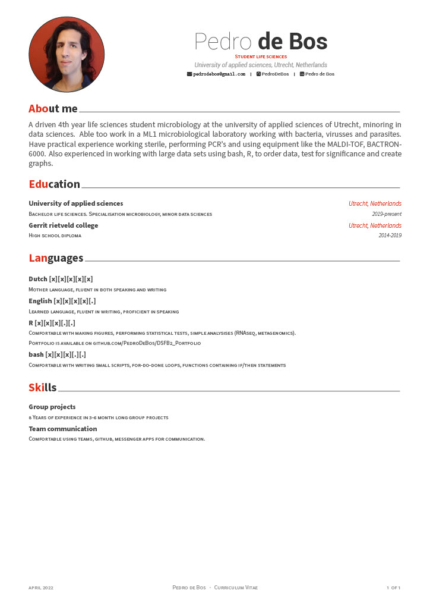

# CV
<body id="start">

  <a href='index.html#frontpage'>Front page</a>
  <a href='visualising-data.html#visualising-data'>Data visualisation</a>
  <a href='sorting-directories.html#sorting-directories'>Directory structure</a>
  <a href='cv.html#cv'>CV</a>
  <a href='plan-for-future.html#plan-for-future'>The future</a>

To create my CV, a package called "vitae", created by "Mitchello Harawild" has been used. This CV .Rmd file is, however, not compatable with bookdown (which was used to create this site). This .RMD generates a pdf, of which a .jpg file has been generated and is shown here. The original .Rmd file can be found in my [public repo](https://github.com/PedroDeBos/PedroDeBos.github.io).

