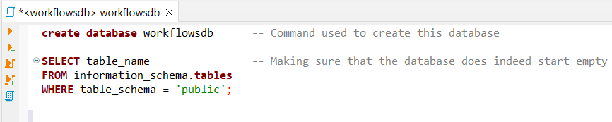
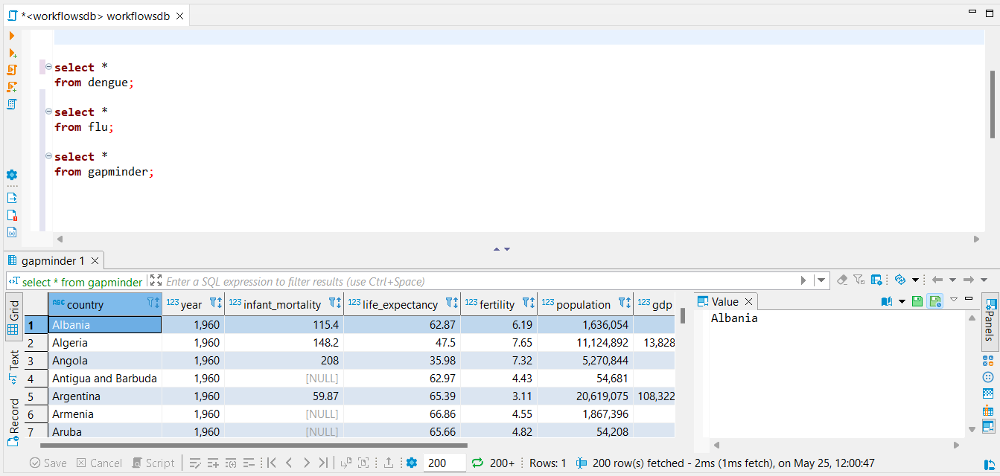
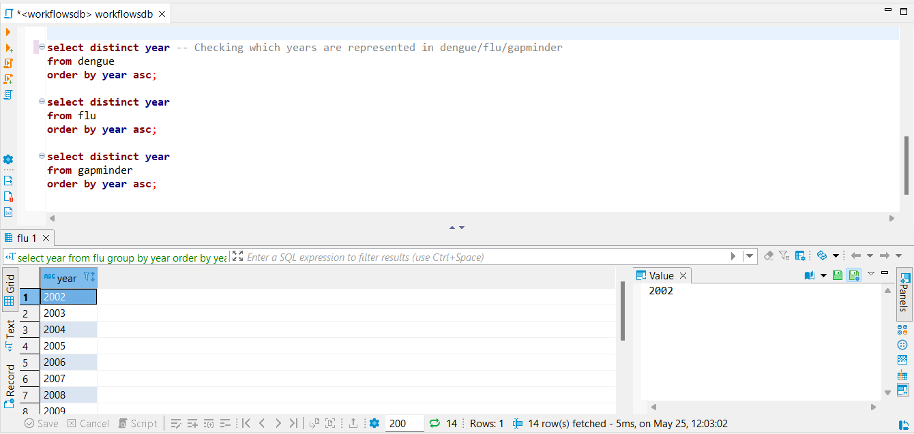

# SQL

<body id="start">
<div class="topnav">
  <a href='index.html#Frontpage'>Frontpage</a>
  <a href='data-visualisation.html#data-visualisation'>Data visualisation</a>
  <a href='parametized-data.html#parametized-data'>Parametizing data</a>
  <a href='directory-structure.html#directory-structure'>Directory structure</a>
  <a href='creating-a-r-package.html#creating-a-r-package'>R-package</a>
  <a href='sql.html#SQL'>SQL</a>
  <a href='bibliography-using-zotero.html#Bibliography using Zotero'>Zotero</a>
  <a href='open-reproductibility-analysis.html#open-reproductibility-analysis'>Reproductibility</a>
  <a href='future-endeavours.html#future-endeavours'>Future endeavours</a>
  <a href='new-skills.html#New-skills'>New skills (Machine learning)<a/>
  <a href='cv.html#cv'>CV</a>
  <a href='bibliography.html#bibliography'>Bibliography</a>
</div>


&nbsp;

In order to prove my skills in the field of data handling and SQL, this page will show me work with flu data, dengue data and the gapminder data from the {dslabs} package. The flu data and dengue data are both supplied by google, "www.google.org/flutrends AND www.google.org/denguetrends"

First of all, all datasets will be read and inspected in R

```{r dependencies_008, include=FALSE}
library(dslabs)
library(tidyverse)
library(RPostgreSQL)
library(RPostgres)
library(DBI)
library(here)
library(DT)
```


```{r inspectingData}
#The gapminder dataset
gapminder %>% head()

dengue<-read.csv("./data.raw/dengue_data.csv", skip = 10)
#The dengue dataset
dengue %>% head()

flu<-read.csv("./data.raw/flu_data.csv", skip = 10)
#The flu dataset
flu %>% dplyr::select(Date:Japan) %>% head() #Selected till Japan for a cleaner table
```

Both the flu and the dengue datasets are not tidy: Each row contains the incidence rate (observation) of dengue/flu of multiple countries, while each row is only supposed to have 1 observation. The datasets will be wrangled to be tidy

```{r wranglingDataSets}
dengue_tidy<-dengue %>% pivot_longer(cols = Argentina:Venezuela,
                        names_to = "country",
                        values_to = "dengue_incidence")
dengue_tidy %>% head()

flu_tidy<-flu %>% pivot_longer(cols = Argentina:Uruguay,
                     names_to = "country",
                     values_to = "flu_incidence")
flu_tidy %>% head()


```

Now the data is tidy, however, to make the dengue/flu data relational, the "date" data needs to be properly synchronized. To do this, the "date" will be split into "year", "month" and "day". These will be changed from character vectors to integers

```{r}
flu_separate<-flu_tidy %>% separate(col = Date, into = c("year", "month", "day"))
flu_separate$year<-flu_separate$year %>% as.integer()
flu_separate$month<-flu_separate$month %>% as.integer()
flu_separate$day<-flu_separate$day %>% as.integer()

dengue_separate<-dengue_tidy %>% separate(col = Date, into = c("year", "month", "day"))
dengue_separate$year<-dengue_separate$year %>% as.integer()
dengue_separate$month<-dengue_separate$month %>% as.integer()
dengue_separate$day<-dengue_separate$day %>% as.integer()
```

Now, with the data properly relational, it'll be written into .csv's and .rds'

```{r, eval=FALSE}
flu_separate %>% write.csv(file = "./data/flu.csv")
flu_separate %>% write_rds(file = "./data/flu.rds")
dengue_separate %>% write.csv(file = "./data/dengue.csv")
dengue_separate %>% write_rds(file = "./data/dengue.rds")
gapminder %>% write.csv(file = "./data/gapminder.csv")
gapminder %>% write_rds(file = "./data/gapminder.rds")
```


Using the SQL script shown in the screenshot below, a SQL database has been created called "workflowsdb".



Using RPostgreSQL, the created datasets will be inserted into this database

(Creating a connection with SQL requires a password: in order to prevent the leakage of my password, the local RDS datafiles created above have been used instead of using the datafiles from an SQL database. The code which would be used _if_ I were to use my password will still be shown)


```{r, eval=FALSE}
source(here("R/login_credentials.R"))
con <- dbConnect(RPostgres::Postgres(),
                 dbname = "workflowsdb",
                 host = "localhost", 
                 port = 5432,
                 user= "postgres",
                 password = rawToChar(pwd))

dbWriteTable(con, "gapminder", gapminder)
dbWriteTable(con, "dengue", dengue_separate)
dbWriteTable(con, "flu", flu_separate)
```

To inspect the database in order to check if all data has been transfered correctly, another SQL script has been used. Once again, screenshots of this script have been added underneath.





For further insurance, the data will also be inspected via R

```{r include=FALSE}
gapminder<-readRDS(here("./data/gapminder.rds"))
dengue<-readRDS(here("./data/dengue.rds"))
flu<-readRDS(here("./data/flu.rds"))
```


```{r, warning=FALSE, message=FALSE, eval=FALSE}
source(here("R/login_credentials.R"))
con <- dbConnect(RPostgres::Postgres(),
                 dbname = "workflowsdb",
                 host = "localhost", 
                 port = 5432,
                 user= "postgres",
                 password = rawToChar(pwd))

gapminder<-dbReadTable(con, "gapminder")
dengue<-dbReadTable(con, "dengue")
flu<-dbReadTable(con, "flu")

```

We want to join the datasets based on "year" and on "countries", thus we shall inspect those character vectors in partciular

```{r}
list(gapminder_years=gapminder$year %>% unique(),
     dengue_years=dengue$year %>% unique(),
     flu_years=flu$year %>% unique())
```

Based on the years, we can state that dengue and flu share the same range of years, while gapminder has a way bigger range of years it covers

```{r}
list(gapminder_countries=gapminder$country %>% unique %>% head(50),
     dengue_countries=dengue$country %>% unique,
     flu_countries=flu$country %>% unique)
```

In the countries, we can see a way wider spread of countries. Gapminder contains data of over 180 countries (only the top 50 are shown), while flu has 30 and dengue has 10. In order to create a full, properly joined dataset we will filter all 3 datasets to only contain shared years and shared countries


```{r, warning=FALSE}
dengue_countries<-dengue$country %>% unique()
dengue_flu_countries<-flu$country %>% str_extract(pattern = dengue_countries) %>% unique() #Filtering for countries which are present in both dengue and flu
dengue_flu_countries<-dengue_flu_countries[!is.na(dengue_flu_countries)] #Filtering for NA's

gapminder$country %>% str_subset(pattern = dengue_flu_countries) %>% unique 
```

Based on these filters, the for countries available in every dataset are: `r gapminder$country %>% str_subset(pattern = dengue_flu_countries) %>% unique`

```{r, warning=FALSE}
flu_year<-flu$year

gapminder_join<-gapminder %>% filter(year <= max(flu_year) & year >=min(flu_year)) %>% 
  filter(country %in% dengue_flu_countries)

data_full<-left_join(gapminder_join, dengue, by = c("country", "year")) %>% left_join(flu, by = c("country", "year", "month", "day"))
```

Now, with this fully joined dataset filtered for both mutual countries and years, some visualisations will be performed

Firstly, dengue incidence in 4 countries over 15 years

```{r, warning=FALSE}
data_sum_dengue<-data_full %>% group_by(country, year) %>%
  summarise(mean=mean(dengue_incidence, na.rm=TRUE))

data_sum_dengue %>% ggplot(aes(x=year, y=mean))+
  geom_point(aes(color = country))+
  geom_line(aes(color = country))+
  labs(
    title="Dengue incidence over 12 years in 4 countries",
    x="Time in years",
    y="incidence (unit not mentioned)"
  )+
  theme_bw()

```

Secondly, the incidence of flue through the months in the 4 different countries

```{r, warning=FALSE, comment=FALSE}
month_data<-data.frame(
  month=seq(1:12),
  MONTH=c("January", "Februari", "March", "April", "May", "June", "July", "August", "September", "October", "November", "December")
)

month_data$MONTH<-factor(month_data$MONTH, levels =c("January", "Februari", "March", "April", "May", "June", "July", "August", "September", "October", "November", "December"))

data_month<-left_join(data_full, month_data, by="month")

data_month %>% ggplot(aes(x=MONTH, y=flu_incidence))+
  geom_col(aes(fill=country), position = position_dodge())+
  labs(
    title="Flu incidence by month in 4 countries",
    x="Month",
    y="Incidence (unit not mentioned)"
  )+
  theme_bw()+
  theme(axis.text.x = element_text(angle=45, hjust=1))
```

And finally, a correlation between dengue incidence and flu incidence? (Spoiler: no. Not at all.)

```{r, warning=FALSE}
correlation<-cor.test(data_full$dengue_incidence, data_full$flu_incidence, method=c("pearson"))$estimate %>% round(digits = 3)

data_full %>% ggplot(aes(x=flu_incidence, y=dengue_incidence))+
  geom_point(aes(color=country), alpha = 0.8)+
  labs(
    title="Correlation between flu incidence and dengue incidence",
    y="Flu incidence (unit not mentioned)",
    y="Dengue incidence (unit not mentioned"
  )+
  annotate("text", x=2600, y=0.95, label = paste0("Pearson's correlation: \n", correlation))+
  theme_bw()

```