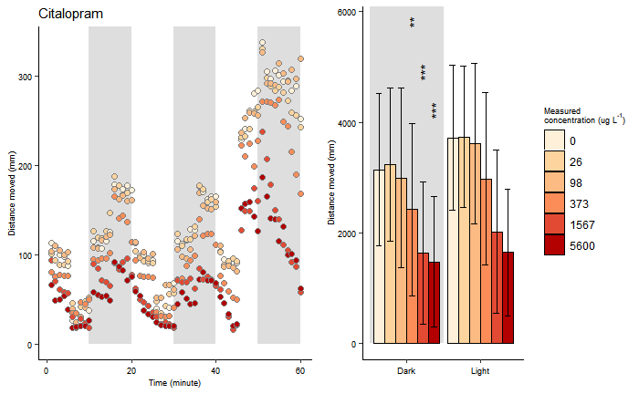

# Open reproductibility analysis
<body id="start">
<div class="topnav">
  <a href='index.html#frontpage'>Front page</a>
  <a href='data-visualisation.html#data-visualisation'>Data visualisation</a>
  <a href='sorting-directories.html#sorting-directories'>Directory structure</a>
  <a href='sql.html#SQL'>SQL</a>
  <a href='r-packages.html#R-packages'>R-package</a>
  <a href='bibliography-using-zotero.html#Bibliography using Zotero'>Zotero</a>
  <a href='reproductibility.html#Reproductibility'>Reproductibility</a>
  <a href='cv.html#cv'>CV</a>
  <a href='plan-for-future.html#plan-for-future'>The future</a>
</div>

&nbsp;

To prove my ability in reviewing articles and identifying (issues in) reproducibility, a random article from the internet has been selected to be analysed based on the reproducibility criteria [found here](https://www.researchgate.net/publication/340244621_Reproducibility_and_reporting_practices_in_COVID-19_preprint_manuscripts) [@sumnerReproducibilityReportingPractices2020].

For this assignment, the following study has been selected: [Behavioral effects of citalopram, tramadol, and binary mixture in zebrafish (Danio rerio) larvae](https://www.sciencedirect.com/science/article/pii/S0045653519318119?via%3Dihub) [@bachourBehavioralEffectsCitalopram2020].

<font size="+2"> __Overview of study__ </font>

In this study, the effects of citalopram (an selective serotonin uptake inhibitor, SSRI) and tramadol (a synthetic opioid) were studied on zebrafish larvae. Citalopram and tramadol have a similair function, both causing serotonin reuptake inhibition, and are known for producing drug-drug interactions, leading to serotonin syndrome in humans. Serotonin syndrome is a potentially life-threatening but highly varied syndrome, created by the use of serotonergic drugs and overactivation of both peripheral and central postsynaptic receptors. [source](https://www.ncbi.nlm.nih.gov/pmc/articles/PMC3865832/). This study aims to identify behavioral and embryotxic effects in embryo-larval zebrafish exposed to citalopram, tramadol or both.

To achieve this, adult zebrafish were allowed to spawn. Eggs produced by this spawn were placed in a 96-wells plate and exposed to test the test conditions (citalopram, tramadol or a combination in increasing concentrations). Incidences of lethal and sublethal effects were observed by stereo microscopy. The embryos were filmed at 24 HPF for 1 minute to determine spontaneous tail coilings per min. Heart rate (heartbeats per minute) were recorded at 48HPF and determined by visual counting. At 144 HPF, swimming activity in response to shifting dark and light conditions was recorded by putting each plate in the Zebrabox tracking system (Viewpoint, France) and filming them for 75 minutes with an inital 15 min of 0%, and then six alternating periods of 100% light to 0% light. Swimming activity was determined as the total swimming distance (mm) per larve per minute, as well as total swimming distance during dark/light periods.

The study found no significant effects in any recorded embryotoxicity endpoint (e.g. heartrate, spontanious tail coiling, incidence of death/malformations) in zebra-larvae exposed to citalopram, tramadol or the mixture. However, at 144HPF, the study found that the compounds caused a decrease in the swimming response of the larvae in response to darkness. It is known that zebrafish larvae display higher activity during dark conditions, presumably due to a stress response triggered by the sudden shift in light. In the study, decreased swimming activity (hypoactivity) during dark conditions was recorded in larvae exposed to citalporam, tramadol and a 1:1 binary mixture of the two. This is shown in the figure below, taken directly from the study.

{width=80% height=80%}

<font size="+2"> __Reproducibility__ </font>

In the table below, the reproducibility of the study has been rated based on the previously given criteria:

```{r, echo=FALSE}
library(DT)

data<-data.frame(
  criteria=c("Study purpose",
             "Data availability",
             "Data location",
             "Study location",
             "Author review",
             "Ethics statement",
             "Funding statment",
             "Code availability"),
  result=c("TRUE", "TRUE", "https://data.mendeley.com/datasets/rcscvwcyx4/2", "FALSE", "1/4", "FALSE", "FALSE", "TRUE" ),
  explanation=c("Purpose stated in introduction",
                "Data stored in 'Mendely Data'",
                "Data in given link",
                "Not stated where the study was performed",
                "1/4 authors had their mail/phone number available",
                "There was no ethics statment",
                "There was no funding statement",
                "The code is available on 'Mendely Data'")
)

datatable(data)
```

In order to further study if the study was truly done reproductible, the data and R code of the study have been downloaded, and will be tested. The full code has been showcased at the bottom of the page.

The code first installs necessary packages, defines functions, and finally actually ultilises the code. 

Data is read -> data gets wrangled using functions -> visibly affected creatures are removed -> citalopram/tramadol concentrations are updated to be the correct, final measurement -> factors are ordered -> data is wrangled for different graphs -> AOV statistics are performed -> figures are plotted



The code used in this project was very nicely tidied, using comments to clarify what different functions do, why certain (otherwise nonsensical) commands are used and are used to separate different kinds of code. There was only 1 error in the script, a function depending on an input of 43200 instead of the correct 86400, but this error was fixed relatively easy.

In terms of readability, I would rate this code a 5/5

In terms of amount of effort it took to fully use the code, I would rate this code a 4/5

However, one point of note is that the code only generates 1 specific figure, while in the final paper, 3 different kinds of figures are used. Furthermore, while the graph displays the same data as the graphs in the paper, it does not look exactly the same: Thus, I expect the final code used for generating the paper is not the same as the code given in the dataset. 

```{r Source code, eval=FALSE}
#####################################
###    Behavior analysis script   ###
###     Author: Johannes Pohl     ###
### orcid.org/0000-0002-8120-8019 ###
###              2019             ###
#####################################

################
### Packages ###
################

if(!require(ggplot2)){install.packages("ggplot2")}
if(!require(multcomp)){install.packages("multcomp")}
if(!require(plyr)){install.packages("plyr")}

#################
### Functions ###
#################

# SummarySE function from Cookbook for R (http://www.cookbook-r.com/Manipulating_data/Summarizing_data/)
summarySE <- function(data=NULL, measurevar, groupvars=NULL, na.rm=FALSE,
                      conf.interval=.95, .drop=TRUE) {
  
  library(plyr)
  
  # New version of length which can handle NA's: if na.rm==T, don't count them
  length2 <- function (x, na.rm=FALSE) {
    if (na.rm) sum(!is.na(x))
    else       length(x)
  }
  
  # This does the summary. For each group's data frame, return a vector with
  # N, mean, and sd
  datac <- ddply(data, groupvars, .drop=.drop,
                 .fun = function(xx, col) {
                   c(N    = length2(xx[[col]], na.rm=na.rm),
                     mean = mean   (xx[[col]], na.rm=na.rm),
                     sd   = sd     (xx[[col]], na.rm=na.rm)
                   )
                 },
                 measurevar
  )
  
  # Rename the "mean" column    
  datac <- rename(datac, c("mean" = measurevar))
  
  datac$se <- datac$sd / sqrt(datac$N)  # Calculate standard error of the mean
  
  # Confidence interval multiplier for standard error
  # Calculate t-statistic for confidence interval: 
  # e.g., if conf.interval is .95, use .975 (above/below), and use df=N-1
  ciMult <- qt(conf.interval/2 + .5, datac$N-1)
  datac$ci <- datac$se * ciMult
  
  return(datac)
}

# Multiplot function from Cookbook for R http://www.cookbook-r.com/Graphs/Multiple_graphs_on_one_page_(ggplot2)/
multiplot <- function(..., plotlist=NULL, file, cols=1, layout=NULL) {
  library(grid)
  
  # Make a list from the ... arguments and plotlist
  plots <- c(list(...), plotlist)
  
  numPlots = length(plots)
  
  # If layout is NULL, then use 'cols' to determine layout
  if (is.null(layout)) {
    # Make the panel
    # ncol: Number of columns of plots
    # nrow: Number of rows needed, calculated from # of cols
    layout <- matrix(seq(1, cols * ceiling(numPlots/cols)),
                     ncol = cols, nrow = ceiling(numPlots/cols))
  }
  
  if (numPlots==1) {
    print(plots[[1]])
    
  } else {
    # Set up the page
    grid.newpage()
    pushViewport(viewport(layout = grid.layout(nrow(layout), ncol(layout))))
    
    # Make each plot, in the correct location
    for (i in 1:numPlots) {
      # Get the i,j matrix positions of the regions that contain this subplot
      matchidx <- as.data.frame(which(layout == i, arr.ind = TRUE))
      
      print(plots[[i]], vp = viewport(layout.pos.row = matchidx$row,
                                      layout.pos.col = matchidx$col))
    }
  }
}

plot.linetype <- scale_linetype_manual(values = c("solid", "solid", "solid", "solid", "solid", "solid", "solid", "solid", "solid", "solid","solid", "solid"), 
                                       breaks=c("C", "SC", "1", "2", "3", "4", "5", "6", "7","8","9","10"), 
                                       labels=c("C", "SC", "1", "2", "3", "4", "5", "6", "7","8","9","10"),
                                       "Treatment") 

plot.fill <- scale_fill_manual(values = c("#000000", "#000000", "#000000", "#000000", "#000000", "#000000", "#000000", "#000000", "#000000", "#000000","#000000", "#000000"), 
                               breaks=c("C", "SC", "1", "2", "3", "4", "5", "6", "7","8","9","10"), 
                               labels=c("C", "SC", "1", "2", "3", "4", "5", "6", "7","8","9","10"),
                               "Treatment") 

plot.color <-scale_color_manual(values = c("#000000", "#000000", "#000000", "#000000", "#000000", "#000000", "#000000", "#000000", "#000000", "#000000","#000000", "#000000"), 
                                breaks=c("C", "SC", "1", "2", "3", "4", "5", "6", "7","8","9","10"), 
                                labels=c("C", "SC", "1", "2", "3", "4", "5", "6", "7","8","9","10"),
                                "Treatment") 

theme.legend <- theme(axis.title.x = element_text(colour="#000000", size = 7),
                      axis.text.x  = element_text(colour="#000000", size = 7),
                      axis.title.y = element_text(colour="#000000", size = 7),
                      axis.text.y = element_text(colour="#000000", size = 7),
                      plot.title = element_text(colour="#000000", size = 11, hjust = 0),
                      title = element_text(colour="#000000"),
                      axis.line = element_line(colour = "#000000"),
                      panel.background = element_blank(),
                      panel.grid.minor = element_blank(),
                      panel.grid.major = element_blank(),
                      legend.background = element_rect(fill = "#FFFFFF", 
                                                       size=0.5, 
                                                       linetype="solid", 
                                                       colour ="#FFFFFF"),
                      legend.key = element_rect(fill = "#FFFFFF"),
                      legend.position="right",
                      legend.title=element_text(size=7)) 

theme.no.legend <- theme(axis.title.x = element_text(colour="#000000", size = 7),
                         axis.text.x  = element_text(colour="#000000", size = 7),
                         axis.title.y = element_text(colour="#000000", size = 7),
                         axis.text.y = element_text(colour="#000000", size = 7),
                         plot.title = element_text(colour="#000000", size = 11, hjust = 0),
                         title = element_text(colour="#000000"),
                         axis.line = element_line(colour = "#000000"),
                         panel.background = element_blank(),
                         panel.grid.minor = element_blank(),
                         panel.grid.major = element_blank(),
                         legend.background = element_rect(fill = "#FFFFFF", 
                                                          size=0.5, 
                                                          linetype="solid", 
                                                          colour ="#000000"),
                         legend.key = element_rect(fill = "#FFFFFF"),
                         legend.position="none") 

datawrangler1A <- function(x){
  x <-subset(x, an==1)
  x$plate <- with(x, paste("A"))
  x$id <- with(x, paste0(location, plate)) 
  x$totaldist <- with(x, smldist + lardist)
  return(x)
}

datawrangler1B <- function(x){
  x <-subset(x, an==1)
  x$plate <- with(x, paste("B"))
  x$id <- with(x, paste0(location, plate)) 
  x$totaldist <- with(x, smldist + lardist)
  return(x)
}

datawrangler2 <- function(x){
  x$epoch <- as.factor(c(rep("A", each=17280), rep(c("Light", "Dark", "Light", "Dark", "Light", "Dark"), each=11520)))
  x <- subset(x,!epoch %in% "A")
  x$minute <- rep(1:60, each=576)
  x$minute2 <- rep(c(2,
                     4,
                     6,
                     8,
                     10,
                     12,
                     14,
                     16,
                     18,
                     20,
                     22,
                     24,
                     26,
                     28,
                     30,
                     32,
                     34,
                     36,
                     38,
                     40,
                     42,
                     44,
                     46,
                     48,
                     50,
                     52,
                     54,
                     56,
                     58,
                     60
  ), each = 1152)
  return(x)
}

datawrangler3 <- function(x){
  
  x <- rbind(as.data.frame(summarySE(summarySE(subset(setNames(aggregate(x[,c("totaldist")], by=list(x$id, x$treatment, x$epoch), "sum"),
                                                               c("id", "treatment", "epoch", "totaldist")), epoch == "Dark"), measurevar = "totaldist", groupvars = c("epoch","treatment", "id")), measurevar = "totaldist", groupvars = c("epoch", "treatment"))),
             as.data.frame(summarySE(summarySE(subset(setNames(aggregate(x[,c("totaldist")], 
                                                                         by=list(x$id, x$treatment, x$epoch), "sum"),
                                                               c("id", "treatment", "epoch", "totaldist")), epoch == "Light"), measurevar = "totaldist", groupvars = c("epoch", "treatment", "id")), measurevar = "totaldist", groupvars = c("epoch", "treatment"))))
  return(x)
}


datawrangler4 <- function(x){
  x <- setNames(aggregate(x[,c("totaldist")], 
                          by=list(x$id, x$treatment, x$minute), "sum"),
                c("id", "treatment", "minute", "totaldist"))
  
  x <- summarySE(x, measurevar = "totaldist", groupvars = c("minute", "treatment", "id"))
  x <- summarySE(x, measurevar = "totaldist", groupvars = c("minute", "treatment"))
  return(x)
}

darkstat <- function(x){
  x <- summarySE(subset(setNames(aggregate(x[,c("totaldist")], 
                                           by=list(x$id, x$treatment, x$epoch), "sum"),
                                 c("id", "treatment", "epoch", "totaldist")), epoch == "Dark"), measurevar = "totaldist", groupvars = c("epoch","treatment", "id"))
  return(x)
}

minuteplotter <- function(x){
  x <- ggplot(data = x, aes(x = minute,
                            y = totaldist, 
                            group = treatment, 
                            fill = treatment, 
                            linetype = treatment, 
                            colour = treatment)) + 
    
    
    annotate("rect", xmin = 10, xmax = 20, ymin = 0, ymax = Inf, alpha = .2) +
    annotate("rect", xmin = 30, xmax = 40, ymin = 0, ymax = Inf, alpha = .2) +
    annotate("rect", xmin = 50, xmax = 60, ymin = 0, ymax = Inf, alpha = .2) +
    
    geom_line() +
    geom_point(size = 2, pch = 21) +
    
    xlab("Time (minute)") + 
    ylab("Distance moved (mm)") 
  return(x)
}

epochplotter <- function(x){
  x <- ggplot(x, aes(x = epoch, y = totaldist, fill = treatment)) +
    annotate("rect", xmin = 0.5, xmax = 1.5, ymin = 0, ymax = Inf, alpha = .2) +
    geom_bar(stat="identity", 
             position=position_dodge(),
             colour="black", 
             size = .3) +
    geom_errorbar(aes(ymin=totaldist-sd, 
                      ymax=totaldist+sd),
                  size = .3,
                  width= .5,                    
                  position=position_dodge(.9)) +
    scale_x_discrete(limits = c("Dark", "Light")) +
    xlab("") + 
    ylab("Distance moved (mm)") 
  return(x)
}

###################################
### Data import and aggregating ###
###################################

dat_plateA <- read.csv("./data/citalopram_plateA.csv", ";", header=TRUE) #had to change directory, to be expected
dat_plateB <- read.csv("./data/citalopram_plateB.csv", ";", header=TRUE)

dat_plateA <- datawrangler1A(dat_plateA)
dat_plateB <- datawrangler1B(dat_plateB)

# Needs to be 43200 observations!
dat_plateA <- head(dat_plateA, -95)
dat_plateB <- head(dat_plateB, -95) 

citalopram.behavior <- rbind(dat_plateA, dat_plateB)

citalopram.behavior <- datawrangler2(citalopram.behavior) #Function datawrangler2 was not behaving properly

# Visibly affected individuals (dead/malformed) removed from data analysis
citalopram.behavior <- subset(citalopram.behavior,
              !(id %in% c('c03A',
                          'c09A',
                          'c18A',
                          'c29A',
                          'c50A',
                          'c60A',
                          'c72A',
                          'c79A',
                          'c89A',
                          'c90A',
                          'c05B',
                          'c07B',
                          'c08B',
                          'c11B',
                          'c25B',
                          'c37B',
                          'c58B',
                          'c63B',
                          'c67B',
                          'c71B',
                          'c72B',
                          'c84B')))

# Treatment measured concentrations added (information on chemical analysis at https://www.sciencedirect.com/science/article/pii/S0045653519318119).
citalopram.behavior$treatment <- as.character(citalopram.behavior$treatment)
citalopram.behavior$treatment[citalopram.behavior$treatment == "c0"] <- "0"
citalopram.behavior$treatment[citalopram.behavior$treatment == "c1"] <- "26"
citalopram.behavior$treatment[citalopram.behavior$treatment == "c2"] <- "98"
citalopram.behavior$treatment[citalopram.behavior$treatment == "c3"] <- "373"
citalopram.behavior$treatment[citalopram.behavior$treatment == "c4"] <- "1567"
citalopram.behavior$treatment[citalopram.behavior$treatment == "c5"] <- "5600"
citalopram.behavior$treatment <- as.factor(citalopram.behavior$treatment)  #Seems like this could've been done within a single command

# Corrected the factor order
print(levels(citalopram.behavior$treatment))
citalopram.behavior$treatment <- factor(citalopram.behavior$treatment,levels(citalopram.behavior$treatment)[c(1,3,6,4,2,5)])
print(levels(citalopram.behavior$treatment))

citalopram.behavior.epoch <- datawrangler3(citalopram.behavior)
citalopram.behavior.minute <- datawrangler4(citalopram.behavior)

##################
### Statistics ###
##################

citalopram.stat <- aov(totaldist ~ treatment, data = darkstat(citalopram.behavior))
summary(citalopram.stat)
plot(citalopram.stat, 2)
hist(residuals(citalopram.stat), col="darkgray")
summary(glht(citalopram.stat, linfct=mcp(treatment="Dunnett")))

################
### Plotting ###
################

citalopram.behavior.minute.plot <- minuteplotter(citalopram.behavior.minute) + 
  plot.linetype +
  plot.color +
  theme.no.legend +
  ggtitle("Citalopram") +
  scale_fill_manual(values=c("#fef0d9", "#fdd49e", "#fdbb84", "#fc8d59", "#e34a33", "#b30000"))

citalopram.behavior.epoch.plot <- epochplotter(citalopram.behavior.epoch) +
  theme.legend +
  annotate("text", x = 1.1 , y = 5800, size = 4, angle = 90, label="**") +
  annotate("text", x = 1.25 , y = 4900, size = 4, angle = 90, label="***") +
  annotate("text", x = 1.4 , y = 4200, size = 4, angle = 90, label="***") +
  guides(fill=guide_legend(title=expression(paste("Measured\nconcentration (ug L"^"-1", ")")))) +
  scale_fill_manual(values=c("#fef0d9", "#fdd49e", "#fdbb84", "#fc8d59", "#e34a33", "#b30000"))

multiplot(citalopram.behavior.minute.plot, citalopram.behavior.epoch.plot, cols = 2) 
```


