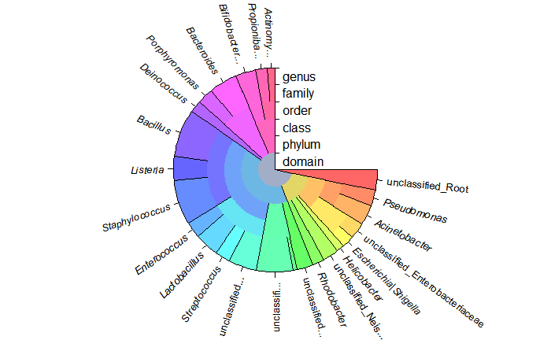
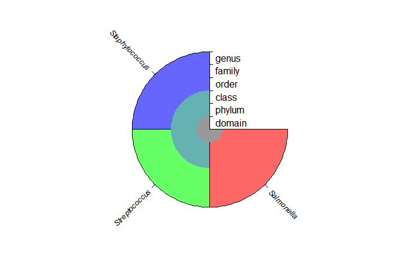

# IDTAXA

<body id="start">
<div class="topnav">
  <a href='index.html#Frontpage'>Frontpage</a>
  <a href='data-visualisation.html#data-visualisation'>Data visualisation</a>
  <a href='parametized-data-germany.html#parametized-data'>Parametizing data</a>
  <a href='directory-structure.html#directory-structure'>Directory structure</a>
  <a href='creating-a-r-package.html#creating-a-r-package'>R-package</a>
  <a href='sql.html#SQL'>SQL</a>
  <a href='bibliography-using-zotero.html#Bibliography using Zotero'>Zotero</a>
  <a href='open-reproductibility-analysis.html#open-reproductibility-analysis'>Reproductibility</a>
  <a href='future-endeavours.html#future-endeavours'>Future endeavours</a>
  <a href='free-research-project-index.html#free-research-project'> Free research (Machine learning)</a>
  <a href='cv.html#cv'>CV</a>
  <a href='bibliography.html#bibliography'>Bibliography</a>
</div>

&nbsp;

```{r, include=FALSE}
library(tidyverse)
library(ggplot2)
library(gridExtra)
library(caret)
library(DECIPHER)

knitr::opts_chunk$set(
  eval=FALSE
)
```

Now, for the grand finale: we'll use all previous knowledge we've gathered, and study an fully developed microbiology machine learning package in R: IDTAXA. 

IDTAXA is part of the DECIPHER package, a package hosted on the bioconductor website. DECIPHER is a "software toolset that can be used for deciphering and managing biological sequences efficiently using R". It contains functions for many different uses, including maintaining databases, aligning sequences, finding genes, and the main use we'll be studying, analysing sequences for classification. 

IDTAXA contains 2 forms of identification: Taxonomy by organism, and taxonomy by functions. ITDAXA: classify organisms takes rRNA or an ITS sequence, and classifies it as a taxonomy of organisms. IDTAXA: classify functions takes a protein or coding sequence, and classifies it as a taxonomy of functions. 

The site for IDTAXA, specifically [this link here](http://www2.decipher.codes/ClassifyOrganismsCode.html), contains a guide on how to perform an IDTAXA identification yourself in R. This guide will be performed on an A: pre-assembled mock data set, B: 3 16sRNA sequences from taken from an online database, and C: 16sRNA sequencces from a random published study.

The process goes as follows: First, store the location of the fasta data, and read it using readDNAStringSet(or RNAStringSet if it's RNA data). Use "remove gaps" to remove any possible gaps found in the data

```{r}
fas<-"./data.raw/HMP_16S.fas.txt"

seqs<-readDNAStringSet(fas)

seqs<-RemoveGaps(seqs)
```

Then, load in the training data set downloaded from the DECIPHER website.

(Please keep in mind, loading this data and performing the machine learning is a very CPU-heavy process. In order to make this .Rmd accessible to those without a strong computer, I've instead ran the code myself, and will only be showing the plots as output)

```{r}
load("./data.raw/Contax_v1_March2018.RData")
```

Now, let the IdTaxa algorythm run, store the output, and use plot() to immdiately plot the output

```{r}
ids<-IdTaxa(seqs,
            trainingSet,
            strand = "both",
            threshold = 60,
            processors = NULL)
print(ids)
plot(ids)
```
print(ids)

 A test set of class 'Taxa' with length 118
 
      confidence name                 taxon
  [1]        78% Acinetobacter bau... Root; Bacteria; Proteobacteria; Gammaproteobacteria; Pseudomonadales; Moraxellaceae; Acinetobacter                
  [2]        78% Acinetobacter bau... Root; Bacteria; Proteobacteria; Gammaproteobacteria; Pseudomonadales; Moraxellaceae; Acinetobacter                
  [3]        78% Acinetobacter bau... Root; Bacteria; Proteobacteria; Gammaproteobacteria; Pseudomonadales; Moraxellaceae; Acinetobacter                
  [4]        78% Acinetobacter bau... Root; Bacteria; Proteobacteria; Gammaproteobacteria; Pseudomonadales; Moraxellaceae; Acinetobacter                
  [5]        78% Acinetobacter bau... Root; Bacteria; Proteobacteria; Gammaproteobacteria; Pseudomonadales; Moraxellaceae; Acinetobacter                
  ...        ... ...                  ...
  
[114]        57% Streptococcus mut... Root; unclassified_Root                                                                                           
[115]        81% Streptococcus pne... Root; Bacteria; Firmicutes; Bacilli; Lactobacillales; Streptococcaceae; Streptococcus                             
[116]        81% Streptococcus pne... Root; Bacteria; Firmicutes; Bacilli; Lactobacillales; Streptococcaceae; Streptococcus                             
[117]        81% Streptococcus pne... Root; Bacteria; Firmicutes; Bacilli; Lactobacillales; Streptococcaceae; Streptococcus                             
[118]        81% Streptococcus pne... Root; Bacteria; Firmicutes; Bacilli; Lactobacillales; Streptococcaceae; Streptococcus   



And easy as that, you've used IdTaxa machine learning to identify the given 16s RNA sequences.

That was for a training dataset that was already pre-assembled. But what if you've got a bunch of individual 16s RNA strands, of which you want to identify all of them? For that, we'll need to manually take some 16s RNA sequences, and put them together into a single file via R.

I've taken 3 random bacterial DNA sequences: 

- One from [streptococcus pyogenes](https://www.ncbi.nlm.nih.gov/genome/175?genome_assembly_id=383877), 
- one from [staphylococcus aureus](https://www.ncbi.nlm.nih.gov/genome/154?genome_assembly_id=360991) and finally, 
- one from [Salmonella enterica typhi](https://www.ncbi.nlm.nih.gov/genome/152?genome_assembly_id=299225).

```{r}
fas1<-"./data.raw/AB002521.1.fasta"
fas2<-"./data.raw/AB243005.1.fasta"
fas3<-"./data.raw/AB594754.1.fasta"

seqs<-readDNAStringSet(c(fas1, fas2, fas3))

seqs<-RemoveGaps(seqs)

ids<-IdTaxa(seqs,
            trainingSet,
            strand = "both",
            threshold = 60,
            processors = NULL)
print(ids)
plot(ids)
```
print(ids)

  A test set of class 'Taxa' with length 3
  
    confidence name                 taxon
[1]        81% ENA|AB002521|AB00... Root; Bacteria; Firmicutes; Bacilli; Lactobacillales; Streptococcaceae; Streptococcus                               
[2]        80% ENA|AB243005|AB24... Root; Bacteria; Firmicutes; Bacilli; Bacillales; Staphylococcaceae; Staphylococcus                                  
[3]        85% ENA|AB594754|AB59... Root; Bacteria; Proteobacteria; Gammaproteobacteria; Enterobacteriales; Enterobacteriaceae; Salmonella              



And thus, like that, we've officially learned how to use the IDTAXA machine learning method for 16s RNA! In the final page of this small research project into machine learning, I've written a self-reflection on what I've learned through performing this research project, some closing thoughts.


<div>
  <button class='button button1' onclick="window.location.href='random-forest-in-glass.html#random-forest-in-glass'" type="button">Return</button>
  <button class='button button2' onclick="window.location.href='closing-words.html#closing-words'" type="button">Continue</button>
</div>


